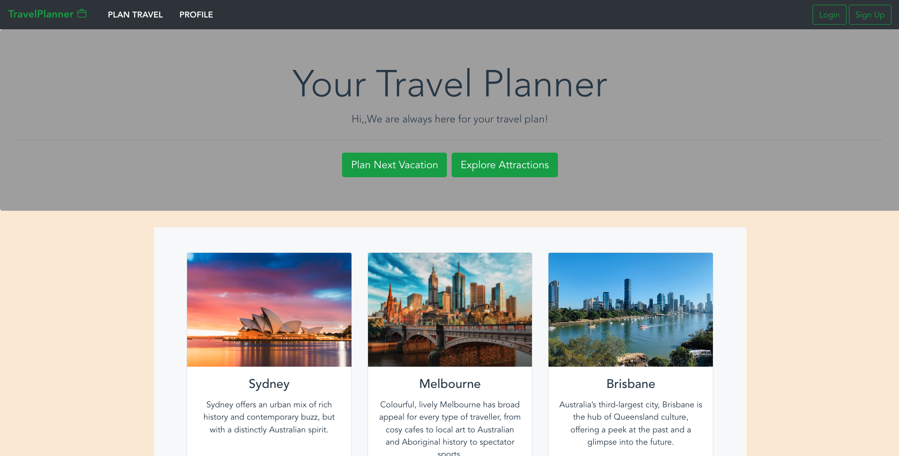
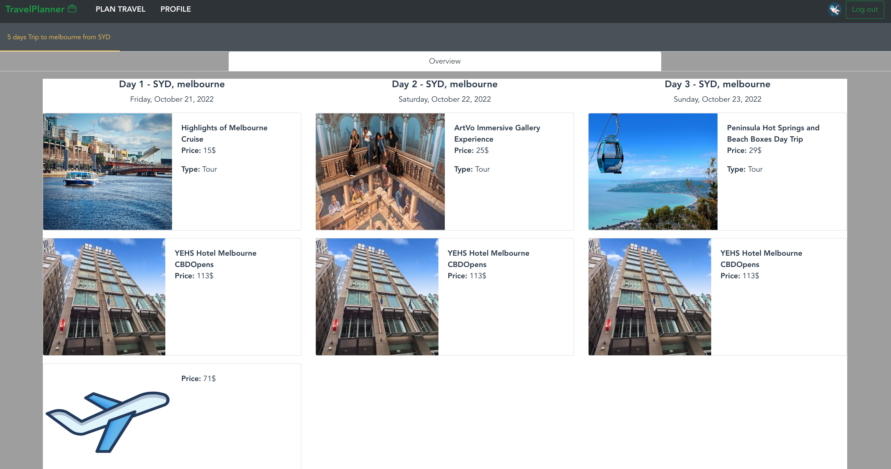
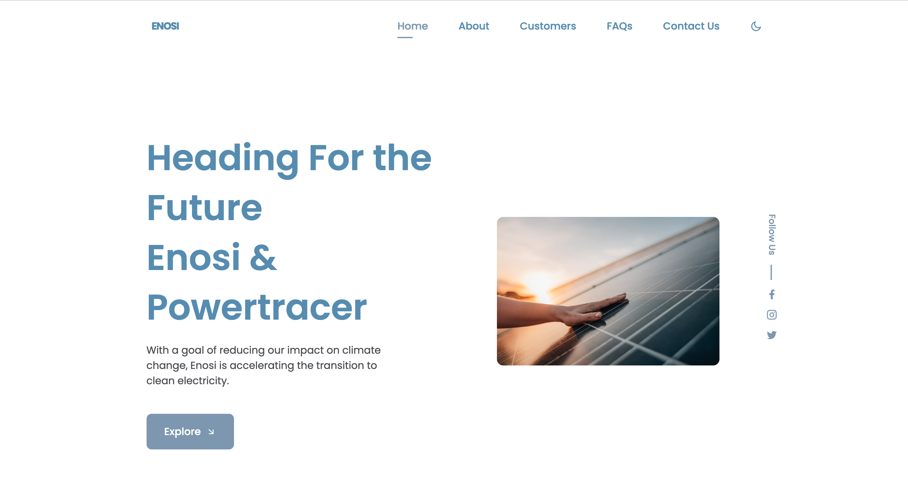
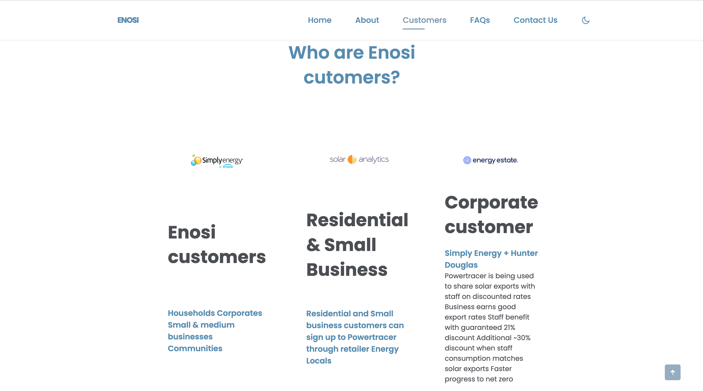
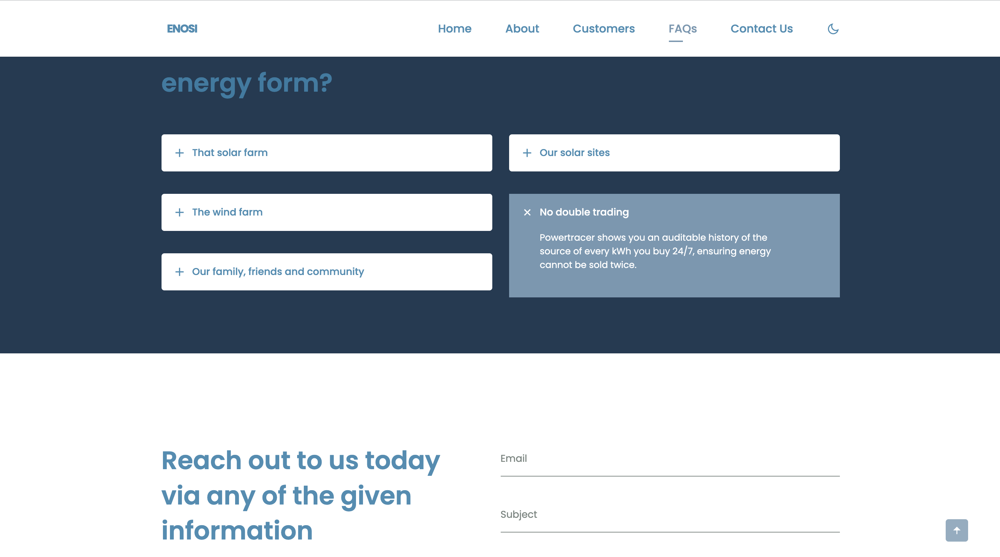
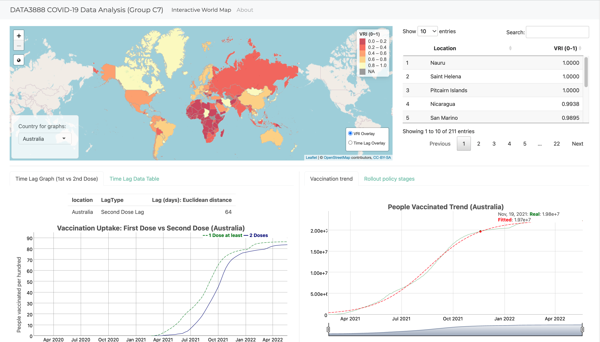

# project-list
My featured projects.
* [Web Development Projects](web-development-projects)
  * [A one-stop booking platform](travelplanner)
  * [A landing page for a clean energy company](powertracer)
* [Data Projects](data-projects)
  * [PwC US Cyber Security Consulting Virtual Job Simulation](pwc-us-cyber-security-consulting-virtual-job-simulation)
  * [KPMG AU Data Analytics Virtual Job Simulation](kpmg-au-data-analytics-virtual-job-simulation)
  * [Analysis of vaccination program (Capstone)](analysis-of-vaccination-program)

## Web Development Projects
### 1. Travelplanner
#### Overview
A usable one-stop booking platform for customised travel plans.
#### Features
Allows customers to choose their 
- travel date and location
- budget and group size
- preferred travel styles. 
- needs fo any mix&match of transport, accommodation and things-to-do.
#### Demo

#### Scope
The locations that users can choose are currently limited in three Australian cities, Sydney, Melbourne and Brisbane, and will be continuing extended.
#### Tools & Languages & Skills 
- Vue.js
- Springboot
- Maven
- ElementUI
- Bootstrap
- Mysql
- Full stack web development
- RESTful API
- Language processing API (External)

##### Link
https://github.com/sylvialqh/Travel-planner.git

### 2. PowerTracer
#### Overview
A landing page for a clean energy company (Enosi) where users can sign up for their energy tracking and trading platform - Powertracer service. 
#### Features
- Eye-catching intro for Enosi & PowerTracer
- Showcase the strength of using powerTracer
- List the cooperators
- FAQ section and contact form
- Sign up form
#### Demo

#### Tools & Languages & Skills
- HTML, CSS, JavaScript
- Customer Journey Map
- Competitive Analysis
- Presentation skills
- Leadership

## Data Projects
### 1. PwC US Cyber Security Consulting Job Simulation on Forage - March 2024
#### Overview
Conducted IT risk assessments and proposed control solutions for a MedTech Industries's IPO preparation.
(MedTech Industries is a non-profit startup.)

The company provided PWC US Enterprise Risk and Control Solutions group with several documents:
1. MedTech Industries P2P(procure-to-pay) Standard Operating Procedure (SOP) document
2. MedTech Industries SDLC SOP
3. MedTech CorpLaw System (i.e.MEdTech's payroll system) ITS Change Management Form

#### Tasks
##### 1. Risk Assessment:
Identify and summarise business process/system control gaps and related risks in regard to Sarbanes-Oxley (SOX) Compliance Requirements.

**Key Solution :** 
* IT General Controls - Access to Program and Data, Program Changes
* Internal Controls for Cash Disbursement - Segregation of Duties, Authorization and Sigining Checking

##### 2. Payroll Software Development Lifecycle (SDLC) Walkthrough Questions
Pinpoint the gaps gaps in MedTech's SDLC and NIST SDLC guide (industry framework that provides leading practices).

##### 3. IT General Controls (ITGC) Test of Design and Operating Effectiveness of MedTech's system CorpLaw
Document the Test of Design and Operating Effectiveness for change management controls.

**Key solution :** 
* Walkthrough CorpLaw's Change Managment ITGC and document on the [ITGC Management template](https://github.com/sylvialqh/data-projects/blob/c3a13e72a6e4a4a50262a12fac393eb177abf3b7/PWC%20Cyber%20Security%20Consulting%20Virtual%20Internship/Updated_Task%203_CorpLaw%20MedTech%20Industries%20ToD%20and%20OE.xlsx)
* A one-slide summary Controls Testing Summary Presentation.

#### Tools & Skills
- Risk Assessment
- Test of Design and Operating Effectiveness documentation

### 2. KPMG AU Data Analytics Job Simulation on Forage - March 2024
#### Overview
Focused on advising Sprocket Central Pty Ltd, an organization that specializes in high quality bikes and cycling accessories sales, on customer targeting by analysing its customer and transactions data.

The organization provided KPMG with 3 datasets:
1. Customer Demographic
2. Customer Addresses
3. Transactions data in the past 3 months

#### Tasks
##### 1. Data Quality Assessment:
Identify the data quality issues and strategies to mitigate this issues.

**Key Solution: Referring to the Data Quality Framework- Accuray, Completeness, Consistency, Currency, Relevancy, Validity, Uniqueness.**

##### 2. Data Insights:
Identify high value customers to target from the new customer list based on analysis of the old customers demographics and attributes.

**Key Solution : RFM Analysis** 

##### 3. Data Visualisation and Presentation:
Develop a dashboard to present key findings of analysis to the client at the next meeting.

**Demo:** 

**Link to Dashboard:** https://public.tableau.com/views/KPMGDataAnalyticsvirtualIntern/Overview?:language=en-GB&:sid=&:display_count=n&:origin=viz_share_link 

#### Tools & Skills
- Jupyter Notebook
- Excel (Pivot Table)
- Customer Segmentation
- RFM Analysis
- Tableau

### 3. Analysis of vaccination program - May 2022
> **Link to Shiny app:** https://dcusyd.shinyapps.io/covidApp/
> 
> FYI. It takes 1-2 minutes to load the page.
#### Overview
Capstone Project.
Aims to investigate factors that affected the implementation of the global COVID-19 vaccination rollout. 
#### Features
- Analysis of the time lag between the 1st and 2nd vaccine dose
- Implementation an innovative index - **VRI**: Vaccine Roll-Out Index (covering speed and coverage of vaccine uptake)
- Estimates of VRI done by Logistic and Asymptotic Regression Model
- Measure importance of socio-economic, demographics, health factors by Random forest (Ranked by Conditional Permutation Importance)
#### Demo

#### Tools & Skills
- R & Python
- Excel
- Machine Learning
- Shiny App
- Solid troubleshooting skills
- SQL queries.
- Technical report writing and presentation skills.

